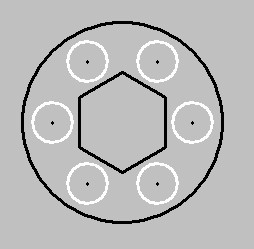
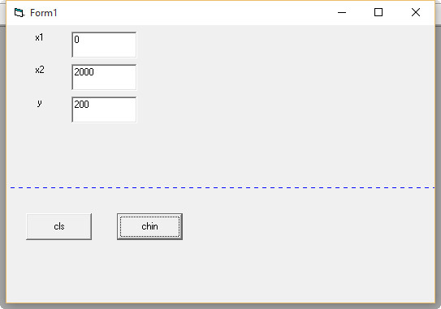
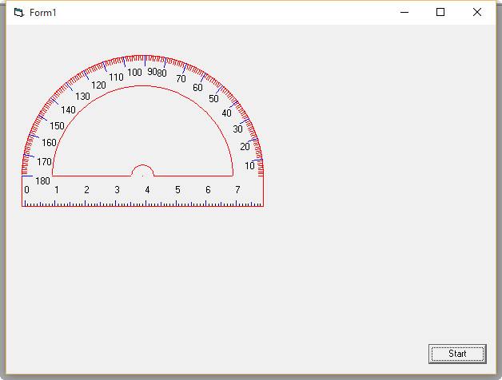

# Graphic-in-VB6
> Fall 2011

# hexagon
```VB6
Private Sub Polygan(ByVal Xc As Integer, ByVal Yc As Integer, ByVal R As Integer, ByVal N As Integer)
CurrentX = Xc + R * Cos(3.14 / 6)
CurrentY = Yc - R * Sin(3.14 / 6)
For Alpha = 3.14 / N To (2 * 3.14) + (3.14 / 6) Step 2 * 3.14 / N
        If t = True Then
           R = R - 25
           t = False
         Else
           R = R + 25
           t = True
         End If
        X = Xc + R * Cos(Alpha)
        Y = Yc - R * Sin(Alpha)
        Line -(X, Y)
Next Alpha
End Sub
```


# circle+hexagon
```VB6
Private Sub Command1_Click()
    ScaleMode = 3
    X = 200
    y = 200
    r = 70
    t = 50
    
    For a = 0 To 2 * 3.14 Step 2 * (3.14 / 6)
        xc = X + r * Cos(a)
        yc = y - r * Sin(a)
        PSet (xc, yc), vbBlack
        Circle (xc, yc), 20
    Next a
    Circle (X, y), 100, vbBlack
    CurrentX = X + t * Cos(3.14 / 6)
    CurrentY = y + t * Sin(3.14 / 6)
    For a = (3.14 / 6) To 2 * 3.14 Step 2 * (3.14 / 6)
        
        xc = X + t * Cos(a)
        yc = y - t * Sin(a)
        
        Line -(xc, yc), vbBlack
    Next a
End Sub
```




# khatchin
```VB6
Private Sub Command3_Click()
    X1 = Text1.Text
    X2 = Text2.Text
    Y = Text3.Text
    If X1 > X2 Then
     t = X1
     X1 = X2
     X2 = t
     End If
    For i = X1 To X2
     If i Mod 10 = 0 Then
     i = i + 5
     End If
     PSet (i, Y), vbBlue
    Next i
End Sub
```



# naghleh
```VB6
Private Sub cp(ByVal xc As Integer, ByVal yc As Integer, ByVal r As Integer)
    pi = 4 * Atn(1)
    Circle (xc, yc), r, vbRed, 0, pi
    Circle (xc, yc), r - r / 4, vbRed, 0, pi
    Circle (xc, yc), r - r / 1.1, vbRed, 0, pi
    Line (xc - r, yc + 10)-(xc + r, yc + 10), vbRed
    Line (xc - r, yc + 10)-(xc - r, yc), vbRed
    Line (xc + r, yc + 10)-(xc + r, yc), vbRed
    Line (xc - (r - r / 4), yc)-(xc - (r - r / 1.1), yc), vbRed
    Line (xc + (r - r / 1.1), yc)-(xc + (r - r / 4), yc), vbRed
    PSet (xc, yc), vbRed
    CurrentX = xc - r
    CurrentY = yc + 10
    For i = 0 To 2 * r - 2
    CurrentX = (xc - r) + (i + 1)
     Line -Step(0, -1)
    CurrentY = CurrentY + 1
    
    If i Mod 10 = 0 Then
    Line -Step(0, -2)
    CurrentY = CurrentY - 5
    CurrentX = CurrentX - 1
    Print i / 10;
    CurrentY = CurrentY + 7
     CurrentX = (xc - r) + (i + 1)
    End If
    
    If i Mod 5 = 0 Then
    Line -Step(0, -1.5), vbBlue
    CurrentY = CurrentY + 1.5
    End If
    Next
    
    s = 180: m = 1
    For i = pi To 2 * pi Step pi / 178
      x = xc + r * Cos(i)
      y = yc + r * Sin(i)
      xm = xc + r / 1.05 * Cos(i)
      ym = yc + r / 1.05 * Sin(i)
      xp = xc + r / 1.1 * Cos(i)
      yp = yc + r / 1.1 * Sin(i)
      PSet (x, y)
      Line (x, y)-(xm, ym), vbRed
      If (s Mod 10 = 0) Or (s = 1) Then
      Line (x, y)-(xp, yp), vbBlue
     If s < 90 Then CurrentX = CurrentX - 3
      
      Print s;
      
    
      End If
       s = s - 1
     Next
End Sub
```

